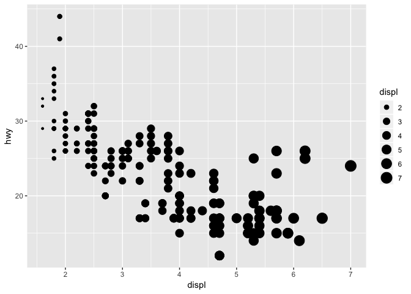
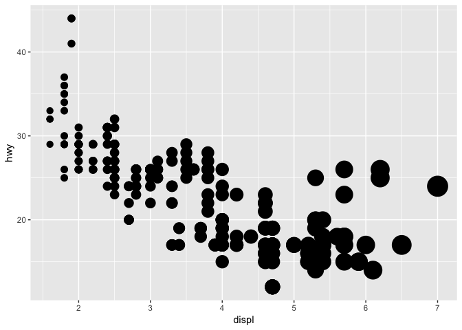

Homework 1: ggplot2
================
Your Name
2019-03-04

``` r
library(ggplot2)
```

By using *mpg* dataset:

1.  Map a continuous variable to color, size, and shape. How do these aesthetics behave differently for categorical vs. continuous variables?

-   Color

``` r
ggplot(data = mpg) +
  geom_point(mapping = aes(x = displ, y = hwy, color = displ))
```


-   Size

``` r
ggplot(data = mpg) +
  geom_point(mapping = aes(x = displ, y = hwy, size = displ))
```



-   Shape

``` r
ggplot(data = mpg) +
  geom_point(mapping = aes(x = hwy, y = class, shape = class ))
```

    ## Warning: The shape palette can deal with a maximum of 6 discrete values
    ## because more than 6 becomes difficult to discriminate; you have 7.
    ## Consider specifying shapes manually if you must have them.

    ## Warning: Removed 62 rows containing missing values (geom_point).


1.  What happens if you map the same variable to multiple aesthetics?

``` r
ggplot(data = mpg) +
  geom_point(mapping = aes(x = displ, y = hwy, pl = displ))
```

    ## Warning: Ignoring unknown aesthetics: pl


1.  What does the stroke aesthetic do? What shapes does it work with? (Hint: use ?geom\_point)

``` r
ggplot(data = mpg) +
  geom_point(mapping = aes(x = displ, y = hwy, stroke = displ))
```



1.  What happens if you map an aesthetic to something other than a variable name, like aes(colour = displ &lt; 5)?

``` r
geom_point(mapping = aes(colour = displ < 5))
```

    ## mapping: colour = ~displ < 5 
    ## geom_point: na.rm = FALSE
    ## stat_identity: na.rm = FALSE
    ## position_identity
